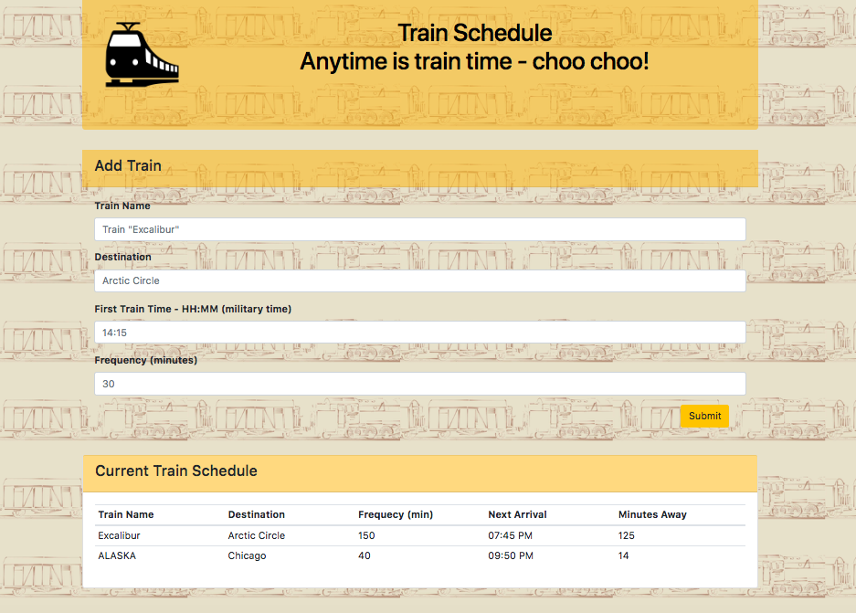

# Train-Schedule-Firebase

Game: Trivia Chicago \
Created for: Northwestern Coding Bootcamp \
Developer: Natalia Kukula \
Deployment Date:  October 4, 2018 \
Published: GitHub <https://nataliakukula.github.io/TriviaGame/> \
Built with: HTML5, CSS3, Bootstrap, Javascript & jQuery

## Summary: 

  
* The user may submit the train time with the specific specs (train name, destination, first train time and frequency).
    
* The app calculates the next train time arrival (and the minutes away) relative to the current time.
  
* User entries are stored in a Firebase database and displayed in a table and accessible from diffrent devices.

## Notes:
First homework utilizing Firebase
